# PMX to XPS Bone Renamer

PMX to XPS Bone Renamer is a Blender add-on that helps batch-rename model bones while converting `.pmx` models used by MikuMikuDance into `.xps` models used by XNALara/XPS.

This tool is intended to be used together with the [CATS Blender Plugin](https://github.com/absolute-quantum/cats-blender-plugin/tree/master). A typical workflow is to import a `.pmx` model, run CATS `Fix Model`, and then use this add-on before exporting or continuing the PMX-to-XPS conversion process.

For a general PMX-to-XPS conversion workflow, see this tutorial:

[https://www.deviantart.com/saratogaroad/art/Tutorial-Convert-from-MMD-to-XPS-839540556](https://www.deviantart.com/saratogaroad/art/Tutorial-Convert-from-MMD-to-XPS-839540556)

Please note that PMX-to-XPS conversion is still imperfect. This add-on does not guarantee a universally correct XPS skeleton. The basic bones like arm, head, leg can be properly named, while other complex bones like hair and skirt still need to be checked. Its automatic rules are based on my own naming habits and the naming patterns I commonly use when preparing XPS models.

## Requirement

- Blender 2.80 or another Blender 2.8x version.
  - The add-on is currently tested on Blender 2.80.
  - Newer Blender versions may work, but they have not been fully tested.
- [CATS Blender Plugin](https://github.com/absolute-quantum/cats-blender-plugin/tree/master)

## What Is Batch Renaming?

Batch renaming means renaming many bones at once according to a set of rules or a reference table.

Instead of manually renaming bones one by one, this add-on creates a rename preview for the whole armature. You can inspect the proposed changes first, then apply the safe ones in one operation.

The add-on can rename bones from several sources:

- Built-in rules for common body bones, hair, skirt, sleeve, and clothing structures.
- Learned mappings generated from previous manual rename examples.
- A custom `.xlsx` file selected by the user.

For the custom `.xlsx` file, column A should contain the current bone name, and column B should contain the desired XPS bone name.

## Why Batch Renaming Is Needed

XNALara/XPS and MikuMikuDance organize and name bones differently.

MMD and CATS-processed bones often use names with underscores, numbers, Japanese/Chinese text, or model-specific conventions. XPS models shared by the community usually use space-separated English names such as:

```text
arm right elbow
hair side left a 2
skirt back right b 1
```

This naming style makes related bones easier to find, sort, and edit together in XNALara/XPS. It also improves compatibility with pose files made for XPS models, because many pose files expect common XPS-style bone names.

Without renaming, related bones may appear as unrelated items in XNALara/XPS, and community pose files may not work directly.

Before renaming:

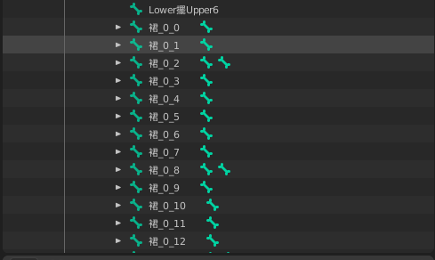

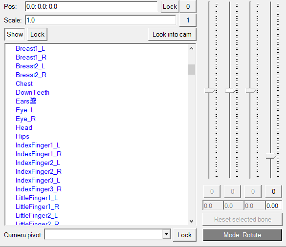

After renaming:

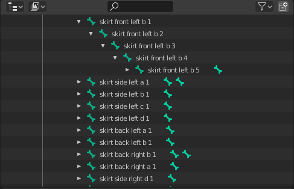

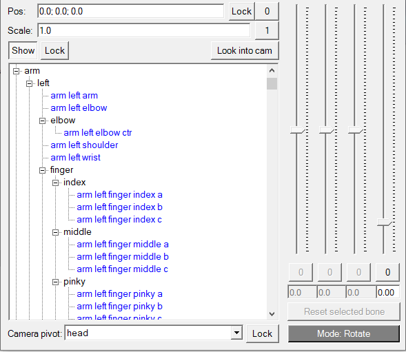

## How to Use This Tool

### How to Install

1. Download or build the add-on zip file.

   If you are using this project locally, the installable zip is usually:

   ```text
   dist/pmx2xps_renamer.zip
   ```
2. Open Blender.
3. Go to `Edit > Preferences`.

   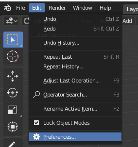
4. Open the `Add-ons` tab and click `Install...`.

   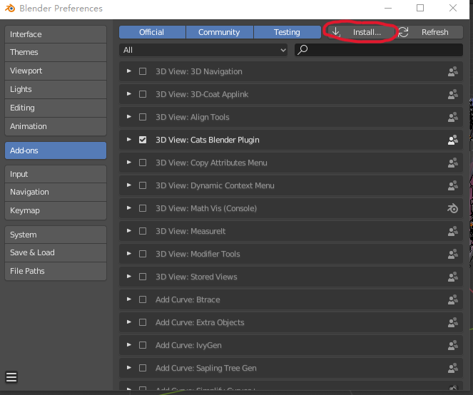
5. Select `pmx2xps_renamer.zip`.
6. Enable `PMX to XPS Bone Renamer`.

   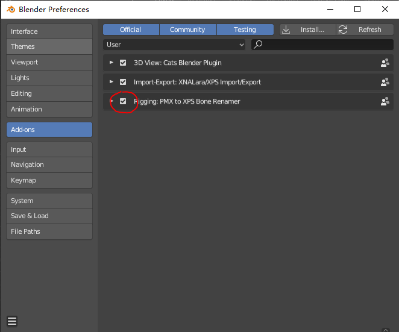
7. In the 3D View, press `N` to open the sidebar. The add-on panel appears under `XPS Rename`.

### How to Use

1. Import your `.pmx` model into Blender.
2. Run CATS `Fix Model` or your usual CATS cleanup steps.
3. Select the model's armature.

   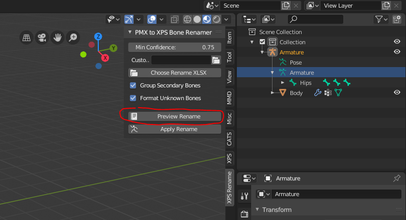
4. Open the `XPS Rename` panel.

   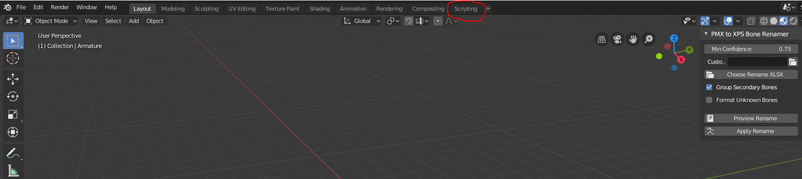
5. Optional: click `Choose Rename XLSX` if you want to use your own two-column rename table.

   The `.xlsx` file should use this format:

   ```text
   Column A: current bone name
   Column B: target XPS bone name
   ```
6. Click `Preview Rename`.

   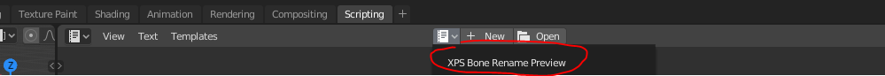
7. Open Blender's Text Editor and check the text block named `XPS Bone Rename Preview`.

   The preview shows which bones will be renamed and why.

   ```text
   APPLY | 0.99 | custom    | OldBone -> new custom bone | custom xlsx mapping
   APPLY | 0.88 | secondary | Sleeve_0_1_R -> sleeve right b 1 | structured hair/sleeve chain
   SKIP  | 0.30 | unknown   | Unknown_1_2 -> Unknown b 2 | unknown numbered chain
   ```
8. Adjust `Min Confidence` if needed.

   Lower values apply more automatic guesses. Higher values are safer.
9. Click `Apply Rename`.

   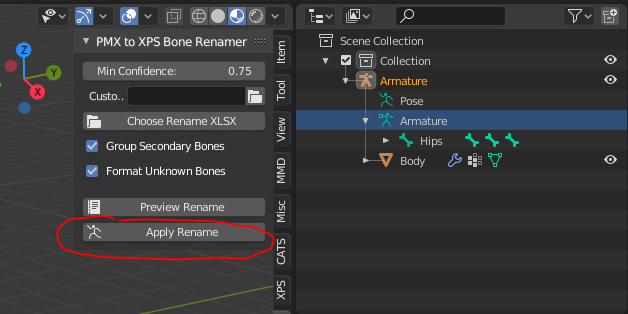
10. Continue your XPS export workflow.

## Notice

* This add-on is experimental and is not an official MMD, CATS, Blender, XNALara, or XPS tool.

The generated names are based on personal naming preferences and observed examples. You should always check the preview before applying changes, especially for complex outfits, physics bones, accessories, weapons, or non-humanoid models.

*  Please use this tool only in ways that respect the rules and permissions of the original MMD model author.

```
Recommended use cases:
```


1. Models where the original author allows editing or conversion.
2. Models with a clear license or permission statement.
3. Personal testing or learning workflows where redistribution is not involved.

Do not use this tool to bypass model permissions, redistribute restricted models, or ignore the original author's usage rules.

* You DON'T need my permission to use it or refine it. However, if you have a better tool please tell me, I want to try it too lol.
* Enjoy it
